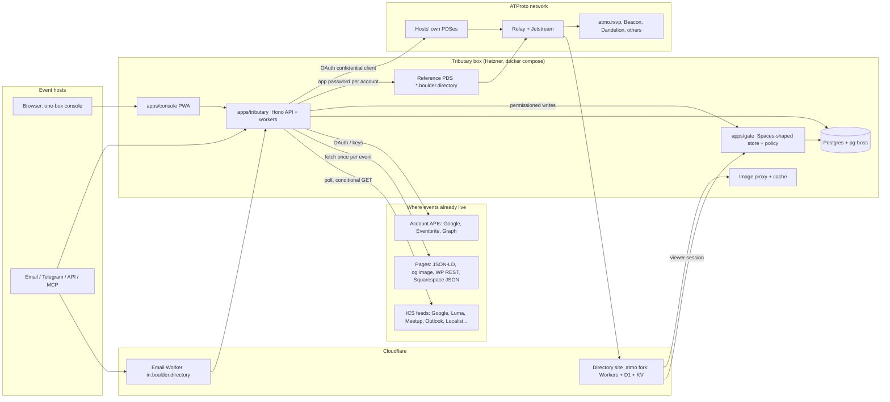

*Benjamin Life (@omniharmonic) · 2026-09-20 · status: draft v0.2 (adds permissions and Spaces)*

# Events Suite — Technical Architecture

*Companion documents: `01_prd.md`, `03_implementation-plan.md`. Sources: the 2026-09-20 research brief; a code teardown of `flo-bit/atmo-events`; direct reads of `bluesky-social/atproto` (packages/pds), `bluesky-social/pds` and `bluesky-social/indigo` (cmd/relay); code reviews of discal.dev, judell/community-calendar, openmeet-api, Bridgy Fed and mobilizon-reshare; for permissions, the R1 Spaces alpha lab notes (2026-09-12), the `permissioned-data` branch and `bluesky-social/bulletin`, the RegenOS lexicon handoff, and a teardown of atmo's and contrail's space code. Facts marked **(verify)** were not confirmed against a primary source and are scheduled as spikes in the plan.*

## 1. System context

Four deployables and one managed dependency. Tributary, the Gate and the PDS run together on one box; the discovery fork runs where upstream runs.



## 2. Stack and why

| Layer | Choice | Reason |
|---|---|---|
| Language | TypeScript on Node 22 | Same as Free School and the atmo fork, so types for the event record and the normalizer are shared across all three. The reference OAuth client (`@atproto/oauth-client-node`) and the best ICS tooling are TypeScript. A Rust port of the publisher is a later seam (section 19), not a v1 cost |
| API | Hono | Already used in `apps/appview` for Free School; reuse the auth, session and custodial-signup code |
| Database and jobs | Postgres 16 + pg-boss | Already running for Free School. Per-source schedules, retries and singleton jobs come free |
| Console | Vite + React + TanStack + Tailwind 4 | Same as Free School's `apps/web`. The preview imports the card component from the fork's `packages/ui` build so preview and production rendering cannot drift |
| Permissions | `apps/gate`: a Spaces-shaped store and Techne policy engine; Postgres backend now, Spaces alpha backend in labs, real Spaces later | The same seam Free School settled on after the R1 lab. Section 9 |
| PDS | `ghcr.io/bluesky-social/pds` | Reference implementation; multi-domain handles and on-demand TLS are built in (section 8) |
| Discovery site | Fork of `flo-bit/atmo-events` on Cloudflare Workers + D1 + KV | Run it the way upstream runs it to keep merges cheap. contrail has a Postgres adapter (Free School uses it) if we ever need to leave Cloudflare |
| Inbound email | Cloudflare Email Workers → signed webhook to Tributary | Free, no mail server to run |
| Outbound email | Resend (already connected) | Magic links, confirmations, host notices |
| Extraction models | Small multimodal model via API, structured output | Under a cent per flyer; every extraction is confirmed by a person |
| Geocoding | Self-hosted Photon on the box, LocationIQ free tier as fallback, results cached permanently by normalized address | Public Nominatim forbids this kind of use |

Monorepo layout (pnpm), mirroring Free School:

```
apps/tributary        API, workers, connectors runtime
apps/console          one-box UI, host dashboard, curator tools
apps/mcp              MCP server (thin client of the API)
apps/gate             permission service: SpaceStore, policy engine, invites, approvals, audit
packages/event-model  NormalizedEvent, record builder, lexicon validation, card profile
packages/connectors   one module per source type + the connector SDK (MIT)
packages/detect       input classification and platform fingerprints
packages/extract      model extraction, schemas, prompts, evals
packages/publisher    atproto writers (custodial, OAuth), CAS, blob upload
packages/identity     PDS provisioning, credentials, claims, takeover, exit
packages/spaces-shim  SpaceStore interface + Postgres and alpha backends (shared with Free School)
packages/policy       predicate evaluation over membership, invite, approval and RSVP claims
packages/visibility   classify stage: source signals, rules, field gating, narrowing rule
packages/ssrf-fetch   the only module allowed to make outbound requests to user-supplied URLs
infra/                compose: pds, postgres, tributary, gate, photon, imgproxy, caddy; spaces-alpha-lab
fixtures/             golden ICS corpus, page snapshots, flyer set, expected records
```

## 3. The pipeline

Every input method, however it arrives, goes through the same eight stages. Methods differ only in the first two.

```
ingest → parse → normalize → enrich → classify → reconcile → publish → observe
```

1. **Ingest.** A connector fetches or receives raw material: a feed body, a page, an API response, an email, a file, an image, a string.
2. **Parse.** Source-specific parsing into `RawEvent[]` plus source metadata. Deterministic for structured sources; model-assisted for unstructured ones, which stop here and wait for confirmation.
3. **Normalize.** Into `NormalizedEvent` (section 5): timezone resolution, recurrence expansion, HTML to sanitized markdown, status and mode mapping, location structuring.
4. **Enrich.** Cover image recovery, geocoding, category tagging, organizer name, price text. Cached by source URL and by address.
5. **Classify.** Decide the visibility level, audience and gated fields from the host's override, source signals, rules and the source default (section 9.4).
6. **Reconcile.** Match against what we previously published for this source: new, changed, unchanged, missing, or changed level. Compute a content hash; unchanged means no write.
7. **Publish.** To the host's public repo, to the Gate, or to both for a gated event, according to the level. Build the record, validate it against the base lexicon locally, upload the image blob if new, write with compare-and-swap, store the returned URI and CID.
8. **Observe.** Per-source sync log, metrics, host-facing status, alerts.

## 4. Connector framework

One interface. A connector declares what it can do; the runtime handles scheduling, politeness, retries, storage and everything after parse.

```ts
export interface Connector<Cfg = unknown, Cursor = unknown> {
  type: SourceType;                       // 'ics' | 'gcal-public' | 'luma' | 'meetup' | 'tribe' | ...
  capabilities: {
    live: 'poll' | 'push' | 'none';
    delta: boolean;                       // supports cursors / sync tokens
    explicitDeletes: boolean;             // source tells us about deletions
    images: 'native' | 'via-page' | 'none';
    requiresAuth: 'none' | 'apiKey' | 'oauth';
  };
  detect?(input: DetectInput): Promise<DetectMatch | null>;   // used by packages/detect
  configure(input: DetectMatch | UserConfig): Promise<Cfg>;   // e.g. resolve a Luma page to its ICS URL
  fetch(cfg: Cfg, cursor: Cursor | null, ctx: FetchCtx): Promise<{
    events: RawEvent[];
    cursor: Cursor | null;
    complete: boolean;                    // true = this is the full current set (enables missing-detection)
    window?: { from?: Date; to?: Date };  // what time range the source actually covers
    notModified?: boolean;
  }>;
  handlePush?(req: PushPayload, cfg: Cfg): Promise<RawEvent[]>;  // webhooks, email, bot
  defaultInterval: Duration;
}
```

`FetchCtx` exposes only `ctx.http` (the SSRF-safe client with per-domain rate limits, conditional GET, robots check and the identifying user agent), `ctx.secrets` for the source's own credentials, and a logger. Connectors cannot open sockets any other way.

### 4.1 Connector catalogue and mechanics

| Connector | Discovery from pasted input | Read path | Change detection | Images | Interval |
|---|---|---|---|---|---|
| `ics` (generic) | Any URL returning `text/calendar`; `webcal://` rewritten to `https://`; `<link rel="alternate" type="text/calendar">` | Full feed | ETag / Last-Modified; `SEQUENCE`, `LAST-MODIFIED`; set difference inside the feed's window | `ATTACH;FMTTYPE=image/*`, Tockify `X-TKF-FEATURED-IMAGE`, else via page | 30 min |
| `gcal-public` | Calendar ID from an ICS URL, embed `src=`, or base64 `cid=` **(verify padding rules)** | Calendar API with an API key: `events?singleEvents=false&showDeleted=true` | `syncToken`, full resync on 410 **(verify with key-only access)**; falls back to the public `basic.ics` | None natively; via description links | 15 min |
| `luma` | Calendar or event URL → calendar ICS `api.lu.ma/ics/get?entity=calendar&id=…` | ICS (UID, SEQUENCE, GEO, LOCATION, organizer, event URL in DESCRIPTION) | As `ics` | Event page: embedded page data `cover_url` **(verify)**, else `og:image` | 30 min |
| `meetup` | Group URL → `/events/ical/` | ICS (TZID, URL, UID `event_<id>@meetup.com`) | As `ics` | Event page JSON-LD `image` **(verify)** | 60 min |
| `tribe` (WordPress Events Calendar) | Probe `/wp-json/tribe/events/v1/events?per_page=1`; `tribe-events` markup | REST, paged, `start_date` filter | Compare `modified`; full set in window | `image.url` native | 60 min |
| `squarespace` | Generator meta; `?format=json` returns `upcoming[]` | JSON collection | Full set | `assetUrl` native | 60 min |
| `localist` | `/api/2/events` responds | API `?days=90&pp=100` | Full set | `photo_url` native | 60 min |
| `mobilize` | `mobilize.us/<org>` | Public `GET /v1/organizations/:id/events` | `updated_since` | `featured_image_url` | 60 min |
| `jsonld-page` | Any page with schema.org `Event` | Parse JSON-LD / microdata | Re-fetch daily until `endsAt` | `image` | 24 h |
| `eventbrite` (A2) | Organizer URL or OAuth | `GET /v3/organizations/{id}/events?expand=venue,logo,organizer,category` | Webhooks `event.published/updated/unpublished` + daily reconcile | `logo.original.url` | push |
| `gcal-oauth` (A1) | OAuth: `calendar.events.readonly` + `calendar.calendarlist.readonly` | `events.list` | `syncToken` + `events.watch` channels renewed before expiry | none | push |
| `msgraph` (A3) | OAuth | `calendarView/delta` | delta link + subscriptions (max 10,080 min, renewed daily) | none | push |
| `discord` (A5) | Bot install | REST + gateway scheduled-event dispatches | push | event cover | push |
| `email` | Per-host address | `.ics` attachments by `METHOD` + `UID` + `SEQUENCE`; else extraction | push | inline images | push |
| `upload` | `.ics`, CSV, XLSX | Parse; column mapper persisted per host | none | URL column | none |
| `sheet` | Google Sheets publish-to-web CSV | Poll | Row hash by `id` column | URL column | 30 min |
| `extract` | Flyer, PDF, free text, unstructured page | Model extraction → confirmation queue | none (page variant re-extracts weekly and asks the host to confirm diffs) | the flyer itself, cropped | none |
| `api` / `webhook` / `mcp` | API key | Host pushes `NormalizedEvent`-shaped JSON with `externalId` | caller-driven | URL or upload | push |

The catalogue order is the build order. community-calendar's production data across eight cities ranks real-world supply as Meetup ICS, Eventbrite, Google Calendar, WordPress Events Calendar, then a long tail (Tockify, LibCal, Localist, Legistar), which matches it.

### 4.2 ICS handling rules (the part that goes wrong)

Library: `ical.js` for parsing with `ical-expander` for occurrence expansion, behind our own wrapper, tested against the golden corpus rather than trusted. Known upstream bugs touch exactly the hard cases (recurrence exceptions, timezone iteration), so the corpus is the contract.

- Timezone precedence: per-property `TZID` with its `VTIMEZONE` → `X-WR-TIMEZONE` → source-level default set at configure time → region default. Floating times are interpreted in that zone and flagged. Never override a `TZID` with a feed default.
- All-day events (`VALUE=DATE`) publish as local midnight to midnight in the resolved zone with `allDay` in source attribution.
- Recurrence: expand `RRULE`/`RDATE` minus `EXDATE`, apply `RECURRENCE-ID` overrides, within a rolling window of 90 days ahead and 1 day back. Each occurrence gets identity `UID#<original-start-UTC>`. A feed that carries only recurring masters produces zero events without this step.
- Identity: `UID` when stable. If a source is observed regenerating UIDs (same title and start, new UID, old UID gone in the same fetch), the source switches to `hash(title-normalized, start, location)` identity and is flagged.
- Windows: many feeds drop past events or cap the future. `fetch()` reports the window actually observed; missing-detection applies only inside it.
- Descriptions: prefer `X-ALT-DESC;FMTTYPE=text/html`, convert with turndown, sanitize, strip tracking parameters and boilerplate footers (Luma's "Get up-to-date information at…", Meetup's group-name prefix), extract the canonical event URL.

## 5. Data model

### 5.1 `NormalizedEvent`

```ts
interface NormalizedEvent {
  identity: { sourceId: string; externalId: string; occurrence?: string };
  name: string;
  descriptionMd?: string;
  start: { instant: string; tz: string; allDay: boolean; tzInferred: boolean };
  end?: { instant: string };
  status: 'scheduled' | 'cancelled' | 'postponed' | 'rescheduled' | 'planned';
  mode: 'inperson' | 'virtual' | 'hybrid';
  locations: Array<{
    name?: string; street?: string; locality?: string; region?: string; postalCode?: string; country?: string;
    lat?: number; lon?: number; precision: 'exact' | 'neighborhood' | 'city'; private: boolean;
  }>;
  joinUrl?: string;
  sourceUrl: string;                 // canonical page for this event; the RSVP target
  links: Array<{ uri: string; name?: string }>;
  image?: { url?: string; bytesRef?: string; alt?: string; width?: number; height?: number; origin: 'source' | 'host-logo' | 'placeholder' };
  organizerName?: string;
  priceText?: string; isFree?: boolean;
  tags: string[]; category?: string;
  series?: { key: string; index?: number };
  provenance: { platform: string; method: SourceType; fetchedAt: string; confidence: 'structured' | 'extracted-confirmed' };
  visibility: Visibility; audience?: Audience; gatedFields?: GatedField[];   // section 9.2
  sourcePrivacy?: 'public' | 'private' | 'confidential' | 'unlisted';        // what the source itself said
  contentHash: string;
}
```

### 5.2 Postgres (app-only state; everything published is rebuildable from repos)

| Table | Purpose | Notes |
|---|---|---|
| `host` | One per publishing identity | `did`, `handle`, `door` (custodial/oauth/listed), `email`, `display_name`, `logo_blob`, `region`, `provenance_level` |
| `credential` | How we write for a host | `kind` (app_password / oauth_session), ciphertext, `key_version`; AES-256-GCM, keys outside the database |
| `source` | One per connected input | `host_id`, `type`, `config` (jsonb), `cursor`, `etag`, `interval`, `next_run_at`, `status`, `consecutive_failures`, `identity_mode`, `window_from/to`, `claimed` |
| `source_event` | Reconciliation ledger | `UNIQUE(source_id, external_id, occurrence)`, `content_hash`, `at_uri`, `at_cid`, `record_version`, `first_seen`, `last_seen`, `missing_since`, `state` (live/cancelled/removed/held), host overrides (jsonb) |
| `pending_confirmation` | Extracted events awaiting a person | payload, preview, channel to notify, expiry |
| `claim` | Claim attempts | `source_fingerprint`, method (token/email), token hash, state |
| `listing` | Curator listings | curator DID, source fingerprint, `at_uri` |
| `removal_block` | Sources that asked not to be listed | fingerprint, date, reason |
| `geocode_cache`, `page_cache`, `image_cache` | Enrichment caches | keyed by normalized address / URL / content hash |
| `api_key`, `inbound_address`, `bot_link` | Push channels | hashed keys; per-host email token; chat account link |
| `sync_run`, `audit` | Observability and accountability | no event bodies, no emails in logs |
| `visibility_rule`, `org_role`, and the Gate's `space*`, `invite`, `access_request`, `gate_audit` | Permissions | section 9.4; the Gate's tables live in their own schema with their own database role |

`source_fingerprint` is a canonical form of the source (normalized feed URL, calendar ID, group slug). It is what makes claims, removal blocks and cross-source duplicate detection work regardless of who added the source.

## 6. The published record

Tributary writes records that stock atmo.rsvp renders completely today. The atmo teardown established exactly what its reader uses, so the profile follows it field for field.

```json
{
  "$type": "community.lexicon.calendar.event",
  "name": "Seed Swap and Garden Planning",
  "description": "Bring seeds, take seeds…",
  "facets": [{ "index": {"byteStart": 120, "byteEnd": 152},
               "features": [{"$type": "app.bsky.richtext.facet#link", "uri": "https://…"}] }],
  "createdAt": "2026-09-22T17:04:11.000Z",
  "startsAt": "2026-10-04T10:00:00.000-06:00",
  "endsAt": "2026-10-04T13:00:00.000-06:00",
  "timezone": "America/Denver",
  "mode": "community.lexicon.calendar.event#inperson",
  "status": "community.lexicon.calendar.event#scheduled",
  "locations": [
    { "$type": "community.lexicon.location.address", "name": "Boulder Public Library, Main",
      "street": "1001 Arapahoe Ave", "locality": "Boulder", "region": "CO", "postalCode": "80302", "country": "US" },
    { "$type": "community.lexicon.location.geo", "name": "Boulder Public Library, Main",
      "latitude": "40.0139", "longitude": "-105.2816" }
  ],
  "uris": [ { "uri": "https://lu.ma/abcd1234", "name": "RSVP on Luma" } ],
  "media": [ { "role": "thumbnail", "alt": "Hands sorting seed packets",
               "content": { "$type": "blob", "ref": {"$link": "bafkrei…"}, "mimeType": "image/jpeg", "size": 412331 },
               "aspect_ratio": { "width": 1600, "height": 900 } } ],
  "preferences": { "showInDiscovery": true },
  "createdWith": "https://tributary.boulder.directory",
  "additionalData": {
    "externalSource": {
      "platform": "luma", "url": "https://lu.ma/abcd1234", "rsvpMode": "external_only",
      "externalId": "evt-WubTRLpINkKUFc7@events.lu.ma", "method": "ics",
      "syncedAt": "2026-09-22T17:04:11.000Z", "profile": 1
    },
    "series": { "key": "b3f1…", "index": 3 },
    "priceText": "Free", "tags": ["gardening", "mutual-aid"], "organizerName": "Front Range Seed Library"
  }
}
```

Decisions embedded here:

- **Inline `media`, `timezone`, `preferences`, `additionalData`** follow atmo's writer exactly (`role: "thumbnail"`, snake_case `aspect_ratio`, IANA string). `additionalData.externalSource.rsvpMode: "external_only"` already switches atmo's event page to "RSVP elsewhere." This replaces the separate sidecar record the research brief proposed: one write, one OAuth scope, atomic updates, and the repo alone is enough to rebuild our ledger after a database loss (`externalId` is in the record). The undeclared fields are proposed to the Lexicon Community as optional additions.
- **Two locations** for in-person events: atmo displays the first address and indexes `geo` for near-me, with precedence geo > fsq > hthree. Coordinates are strings, as the location lexicon requires. A location marked private publishes locality plus an `hthree` cell at neighborhood resolution instead.
- **`startsAt` with the local offset plus `timezone`** matches atmo's writer and keeps the wall-clock time recoverable.
- **`facets`** are generated for links so the description is clickable in atmo, which renders markdown and splices Bluesky-style facets.
- **Validation.** The reference PDS skips validation for lexicons it does not bundle: with `validate` unset it returns "unknown" before checking the record key or fields (`packages/pds/src/repo/prepare.ts`). So undeclared fields are accepted, and nothing downstream catches a malformed record. Tributary therefore validates every record locally against the pulled lexicon JSON before writing (OpenMeet does the same) and never passes `validate: true`.
- **Record keys.** A fresh TID minted at first publish and stored in `source_event`. Deterministic keys were considered and rejected: the lexicon declares `key: tid`, strict readers may enforce it, and every production importer reviewed (discal.dev, OpenMeet, mobilizon-reshare) uses a ledger instead.
- **Listed tier records** are `coop.lexicon.event.listing`-style pointers in the curator's repo for events that already exist on the network, and minimal `calendar.event` records (name, times, place, mode, `uris`, `externalSource` with `listed: true`, no description body, no image) for events that do not. Namespace to be confirmed with Lucian.
- **Unlisted and gated events** are still public records. Unlisted sets `preferences.showInDiscovery: false`, which atmo already honors. A gated event's public record is a teaser: locality and an `hthree` cell in place of the address, no join link, `additionalData.gated: true`, and the detail lives in a space (section 9). Members and invite-only events have no public record.

## 7. Sync engine

**Scheduling.** One pg-boss singleton job per source keyed by `source.id`, so a source never runs concurrently with itself. Interval adapts: halves after a change is seen (floor 10 min), doubles after 20 unchanged runs (ceiling 6 h), with jitter. Failures back off exponentially; after 24 h failing the host is emailed in plain language; after 14 days the source pauses and its events stay up.

**Reconcile.**

| Observed | Action |
|---|---|
| New identity | Enrich, publish, insert ledger row |
| Same identity, different `contentHash` | `putRecord` with `swapRecord: at_cid`; on CAS failure re-read and retry once, else flag (someone edited the record in another app; host decides) |
| Same identity, same hash | Touch `last_seen`; no write |
| Source says cancelled (`STATUS:CANCELLED`, `METHOD:CANCEL`, API status) | Publish `status: #cancelled` immediately |
| Missing from a complete fetch, inside the source window, future-dated | Set `missing_since`. After two consecutive complete fetches and at least 6 h: publish `#cancelled`. After 7 days: `deleteRecord` |
| Missing, but the event has ended or is outside the window | Leave it. Past events are history |
| Fetch failed or incomplete | Change nothing |
| Host override exists (hidden, image replaced, category fixed) | Apply over the source value on every publish |
| `record_version` older than the current profile version | Republish in a throttled background migration (discal.dev's pattern) |

**Write budget.** `applyWrites` batches up to 200 operations for first imports. Steady state is a handful of writes per host per day, far below the PDS default of 5,000 points per hour.

**Echo.** The fork will see our records arrive over Jetstream like anyone's. `createdWith` and `externalSource` identify them; nothing in Tributary consumes the firehose in v1, so there is no loop to suppress.

**Cross-source duplicates** are the discovery site's job, not the publisher's, because the two copies legitimately live in two repos. Tributary helps by stamping `externalSource.url` canonically, and by refusing to add a source whose fingerprint is already connected by another host. The fork groups by canonical source URL, then by (date, H3 cell, normalized title) with community-calendar's guards: exact keys first, prefix match only above 12 characters and under a 75% length ratio, primary source beats aggregator. One normalization function, imported from `packages/event-model` by both codebases. No model-based fuzzy matching; community-calendar measured about 90% false positives.

## 8. Identity and the PDS

### 8.1 Handles and TLS

`PDS_SERVICE_HANDLE_DOMAINS` takes a comma-separated list, and the PDS answers `/.well-known/atproto-did` for any host under those domains. The reference distribution's Caddy config already does on-demand TLS gated by the PDS's `/tls-check`. So one PDS serves `.boulder.directory`, later `.denver.directory`, with wildcard DNS and nothing custom. Handle front labels are limited to 3–18 characters with about a thousand reserved words; the signup form enforces the same rules and suggests alternatives.

### 8.2 Door B: custodial accounts, least privilege

1. Verify the email with a magic link.
2. Mint a single-use invite code with admin auth; call `createAccount` with email, handle and a random 32-byte password.
3. With the session that call returns, create an **app password** named `tributary-sync`.
4. Store only the app password, encrypted. Discard the main password.
5. Publish.

The reason for step 3: there is no admin path to write into a user's repo, so we must hold a credential. App-password sessions can write records and blobs but cannot sign PLC operations or change account credentials (`ACCESS_FULL` only). Holding just the app password means a compromise of Tributary cannot take an identity away from its host. OpenMeet stores the full password and says it wishes it did not have to.

Access tokens last 2 hours and refresh tokens 90 days; workers create a session per run from the app password and cache it briefly.

**Takeover** is the standard password reset by email. It works because we never knew the password. The host can then revoke `tributary-sync` from settings (we offer the button) or keep it so sync continues. **Adding their own rotation key** uses the email-gated PLC signing flow; the console walks them through it and offers a downloadable recovery key. At creation we can also pass `recoveryKey`, which the PDS places first in the rotation key list, above its own key. We do that for organizations that ask. **Migration out** follows the documented flow (`getRepo`, blobs, PLC operation, activate, deactivate); our PDS keeps serving until the old account is deactivated. Tributary notices the DID's new PDS endpoint and continues, prompting for OAuth (Door A) since app passwords do not migrate.

### 8.3 Door A: OAuth confidential client

Client metadata at `https://tributary.boulder.directory/oauth-client-metadata.json`; `private_key_jwt`; `jwks_uri`; PAR and DPoP as required. Scope requested:

```
atproto repo:community.lexicon.calendar.event blob:image/*
```

Create, update and delete on one collection plus image upload. Blob scopes cannot be bundled into permission sets and permission sets can only reference their own namespace, so we request scopes directly. If a host's PDS rejects granular scopes, we tell them and offer Door B rather than silently asking for `transition:generic` **(verify behavior on older PDSes)**.

Refresh tokens are single-use with a 180-day ceiling each, and confidential-client sessions have no overall limit, so background sync runs indefinitely as long as we refresh. With more than one worker, `requestLock` is mandatory: two workers refreshing the same session will invalidate it. We implement the lock in Postgres (advisory lock keyed by DID). A revoked or broken session pauses the host's sources and emails them a one-click reconnect. Permissioned levels need no extra scopes while the Gate stores records itself; `space:` scopes are requested only in Phase B, and only when a host first uses a permissioned level (section 9.5).

### 8.4 Relay visibility

The indigo relay's code default is **100 active accounts for a new host** (`default-account-limit`), higher for `TrustedDomains`, and 50 new hosts per day. Bluesky's production values are not public. Operationally: call `requestCrawl` at launch, then poll the relay's `com.atproto.sync.getHostStatus?hostname=…` daily for `status` and `accountCount`, alert at 70, and ask Bluesky for a raise well before that. Door A hosts do not count against our limit, which is one more reason to offer it prominently to anyone who already has an account.

### 8.5 Moderation plumbing

The reference PDS ships with no moderation or report service configured. We set `PDS_REPORT_SERVICE_*` to our own endpoint, handle reports in the steward queue, and use `com.atproto.admin.updateSubjectStatus` for record, blob or account takedowns on custodial accounts. For records in other people's repos we can only de-index on our site.

## 9. Permissions and Spaces

### 9.1 What we found, and what it rules out

| Fact | Source | Consequence |
|---|---|---|
| atmo's private events are an application-level store: `ats://<owner>/<type>/<key>` rows in atmo's D1 (`spaces`, `spaces_members`, `spaces_invites`, `spaces_records_*`), binary owner/member, never in a PDS, never on the firehose, and switched off in production (`if (!dev) error(403, 'Private events are not available yet')`) | atmo-events and contrail source | A fork's private events would exist only in the fork. Not portable, not a protocol feature |
| contrail deleted its spaces, authority and record-host modules in 0.13.0; atmo pins `@atmo-dev/contrail@0.12.2` to keep them | contrail CHANGELOG | The code is a dead end upstream. Removing it from our fork also unpins contrail (current 0.23, which has the Postgres adapter Free School uses) |
| Official Spaces alpha: `com.atproto.simplespace.*` (create, policy, members) and `com.atproto.space.*` (records, credentials, sync). Space `at://{authority}/space/{type}/{skey}`; record appends `/{author}/{collection}/{rkey}`. Records stay in each author's repo on their own PDS and never reach the firehose | R1 lab (ran), `permissioned-data` branch | This is the target shape |
| Read is whole-space. No per-collection read exists in the policy, the member row, the credential or the scope grammar | R1 (ran) | One space per audience |
| The authority can always read its space. Repo hosts hold rows in plaintext | R1 (ran) | Access control, not confidentiality; say so |
| Non-member writes succeed locally and are simply never synced. A removed member's credential works until it expires (7,200 s) | R1 (ran) | Truth is the writer set, not the row. Revocation also enforced app-side |
| Policies: `public`, `memberList`, or `managingApp` (the authority's PDS asks an external service `checkUserAccess(space, user, access)` with service auth; fails closed). Read and write policies are independent as of the 2026-09-18 delta | alpha lexicons, bulletin source | Techne's declarative policies can govern a real space by being the managing app |
| Ownership is a bare DID equality check. No delegation of manage rights | R1, alpha lexicons | A group space's authority is a custodied group DID, as Free School's school DID already is |
| App-password sessions can create spaces and write space records for their own repo but cannot call `getDelegationToken` (`ACCESS_FULL` only), so cannot read via credential | R1 (ran) | Compatible with section 8.2: Tributary only writes. Reading is the indexer's job |
| OAuth grammar: `space:<type>?authority=&skey=&collection=&action=&manage=`. Collection granularity applies to writes only | `oauth-scopes` source | Door A scope strings below |
| No `uploadBlob` in the space namespace. Blobs go through ordinary `com.atproto.repo.uploadBlob` and are referenced from the space record; `com.atproto.space.getBlob` is credential-gated | alpha lexicons | **(verify)** whether such a blob is also reachable through public `com.atproto.sync.getBlob`. Until proven otherwise, private images never touch a PDS |
| No invite primitive. No export or migration of a space when its authority changes PDS. `deleteSpace` deletes the authority's rows and only flags members' | alpha lexicons | Invites are ours to build. Authority accounts stay put. Deletion needs our own purge of indexed copies |
| "The code has not undergone careful security review. Do not upload sensitive information." Weekly breaking changes; GA "later this year"; the mainline PDS image does not include it | Bluesky, 2026-08-20 | Do not run real people's permissioned data on it yet |

### 9.2 Model

`NormalizedEvent` gains:

```ts
visibility: 'public' | 'unlisted' | 'gated' | 'members' | 'invite' | 'held';
audience?: { group?: Did; minRole?: number; inviteListId?: string; approval?: 'open' | 'approval' };
gatedFields?: Array<'exactLocation' | 'joinUrl' | 'attendeeNotes' | 'contacts'>;
visibilitySource: 'host-default' | 'rule' | 'source-signal' | 'per-event' | 'api';
```

How each level maps to records and spaces, using Techne's existing sidecars and space types (names to be confirmed with Lucian; space-type NSIDs need at least three segments):

| Level | Public repo | Space | Space policy |
|---|---|---|---|
| public | `calendar.event` (section 6) | — | — |
| unlisted | same, `preferences.showInDiscovery: false` | — | — |
| gated | teaser `calendar.event`: coarse location (locality plus an `hthree` cell), no join link, `additionalData.gated: true`; `coop.lexicon.event.config` with `attendance: approval` when approval is on | `coop.lexicon.space.event.detail`, skey = event rkey, holding one `coop.lexicon.event.detail` (`exactLocation`, `exactPin`, `attendeeDetails`) | read: `any(confirmedFor(this), authorityOnly, memberRole(authority, atLeast: 20))` |
| members | nothing | the group's calendar space, skey per audience (`members`, `stewards`), holding full `calendar.event` records and RSVPs | read/write: `memberRole(authority, atLeast: n)` |
| invite | nothing | `coop.lexicon.space.event.invite`, skey = a fresh TID, holding the event, config, invites, RSVPs, approvals | `any(invited(this), sharedWith(this), memberRole(authority, atLeast: 10))` |
| held | nothing | nothing | — |

The gated teaser deliberately reveals that a detail space exists; that is the feature. Members and invite-only events publish no public pointer, because a public reference to a space discloses its existence, its authority DID and its type.

### 9.3 The Gate

`apps/gate` is a small Hono service used by both Tributary and the discovery site. It owns four things.

1. **`SpaceStore`**, the interface lifted from Free School's `packages/spaces-shim`: `createSpace`, `getSpace`, `putMember`, `removeMember`, `listMembers`, `putRecord`, `deleteRecord`, `listRecords(asViewer)`, `getRecord(asViewer)`, `putBlob`, `getBlobUrl(asViewer)`. Two backends behind it: **Postgres** (Phase A) and **alpha Spaces** (labs now, Phase B later). Addresses use the alpha's exact shape in both, so a record's address does not change at migration.
2. **Policy engine** (`packages/policy`): evaluates Techne's positive-only predicates (`memberRole`, `invited`, `sharedWith`, `confirmedFor`, `connectionOf`, `authorityOnly`, `any`, `all`) over claims: `coop.lexicon.membership` role records, invite and share records, approvals, confirmed RSVPs. In Phase A it answers the Gate's own reads. In Phase B the same function answers `com.atproto.simplespace.checkUserAccess` as the managing app, verifying the authority PDS's service-auth signature and failing closed.
3. **Invites and approvals.** Hashed single-view tokens with expiry and use counts (atmo's `join` / `read` / `read-join` kinds are a good design and are kept); invitations by handle or by email, where an email invitation becomes a DID at redemption through Door A or Door B; approval queue for `attendance: approval`.
4. **Audit.** Who was granted what, by whom, when; membership changes; every widening of visibility. No record bodies.

Every Gate call carries a viewer DID established by the caller's session (the discovery site's OAuth session, or Tributary's host session) or is anonymous. There is no unauthenticated path to a permissioned record, and the not-found and not-permitted responses are byte-identical.

### 9.4 Visibility classification in the pipeline

A new stage sits between enrich and reconcile: **classify**. Inputs, in priority order, are the per-event host override, source signals, host rules, and the source default. Output is `visibility`, `audience`, `gatedFields`.

| Source signal | Read from | Effect |
|---|---|---|
| ICS `CLASS:PRIVATE` / `CONFIDENTIAL` | every ICS connector | ceiling = held, unless the source is mapped to a space |
| Google `visibility: private|confidential`; events on a calendar reached only by OAuth | `gcal-*` | same |
| Microsoft `sensitivity: private|confidential` | `msgraph` | same |
| Platform flags: Luma private or unlisted, Meetup members-only groups, Eventbrite `listed: false`, invite-only | connectors **(verify which of these the feeds actually expose)** | ceiling = unlisted or held |
| Conference URL detected (Zoom, Meet, Teams, Jitsi, Whereby) in description or location | normalizer | `joinUrl` extracted and gated by default on public events; the description is scrubbed of it |
| Location geocodes to a residential parcel, or the host marked the venue as a home | enricher, venue table | proposes `gated` with `exactLocation`; host confirms once per venue |
| `ATTENDEE`, phone numbers, personal emails | parser | dropped at parse, at every level |

The **narrowing rule** is enforced in reconcile, not in the UI: a transition to a less visible level executes immediately (delete or replace the public record, then write the permissioned one); a transition to a more visible level is written to `pending_confirmation` and needs a person. Reconcile treats a level change as delete-and-create across stores, and the ledger row keeps one identity throughout.

Postgres additions: `visibility_rule(source_id, match jsonb, level, audience jsonb, position)`; `source.default_visibility`; `source_event.visibility`, `.space_uri`, `.teaser_at_uri`; Gate tables `space`, `space_member`, `space_record`, `space_blob`, `invite`, `access_request`, `gate_audit`; `org_role(host_id, did, role)` for who may manage a host's sources.

### 9.5 Writing and reading, Phase A and Phase B

| | Phase A (Gate on Postgres) | Phase B (real Spaces) |
|---|---|---|
| Authority | The group's or host's DID is recorded as authority in the address. Nothing is written to a PDS | Group spaces: the custodied group DID. Event spaces: the host's own DID. Policy: `managingAppPolicy` → the Gate, for both read and write. `appAccess: allowList` naming our clients |
| Tributary writes an event | `SpaceStore.putRecord` as the host | Custodial host: `com.atproto.space.createRecord` with the host's app-password session (allowed; legacy sessions may write their own repo in a space). BYO host: OAuth scope below. `createSpace` first when the space is new |
| Attendee RSVPs | Gate row authored by the viewer DID | The attendee's own repo in that space, written through their OAuth session on the discovery site |
| The discovery site reads | Gate API `listRecords(asViewer)` | **Indexer-as-member.** A Directory indexer account (`indexer.boulder.directory`), whose full session we hold, is added as a read member of every space the Directory serves, visibly, and named in the host's consent text. It obtains a delegation token from its own PDS, exchanges it for a space credential at the authority, then follows bulletin's pattern: `getSpace` to confirm the policy is still ours, `registerNotify` renewed with an hour's margin, `listRepos` reconcile, `listRepoOps` deltas with commit verification, CAR fallback. Per-viewer filtering still happens in the Gate, because a credential reads the whole space |
| Revocation | Immediate | `removeMember` plus app-side denial at once; the protocol's two-hour credential tail documented |
| Images | Object storage on the box, served by imgproxy only with a signed, five-minute URL minted per viewer | Same, until the blob question in 9.1 is settled |
| Deletion | Hard delete in the Gate and the index | `deleteRecord` / `deleteSpace`, purge of our indexed copy on `notifySpaceDeleted` or on any `SpaceDeleted` error, since the notification is best-effort |

Door A scope additions in Phase B, requested only when a host first uses a permissioned level:

```
space:coop.lexicon.space.event.invite?collection=community.lexicon.calendar.event&collection=coop.lexicon.event.config&action=create&action=update&action=delete&manage=create&manage=update
space:coop.lexicon.space.event.detail?collection=coop.lexicon.event.detail&action=create&action=update&action=delete&manage=create&manage=update
```

Phase A needs no new scopes, since nothing permissioned is written to the host's PDS.

**Migration A → B** is a replay: for each Gate space, create the real space with the same type and skey, add members, write each record from its author's session when we hold one, and keep serving Gate-held records for authors who have not signed in since. The Gate reports per-space migration state, and the site reads through the same interface throughout.

### 9.6 Phase B gate conditions

All must hold: (1) Bluesky reports a completed security review; (2) the mainline reference PDS image ships Spaces; (3) four consecutive weekly releases with no breaking change to the calls we use; (4) the blob exposure question is answered; (5) our nightly labs run has been green for thirty days, including the cross-PDS case R1 did not exercise; (6) counsel has reviewed the retention and disclosure text. Techne's standing review trigger applies as well: a third-party Spaces implementation interoperating with ours by about Q1 2027.

### 9.7 Labs

`infra/spaces-alpha-lab` from Free School, extended: the alpha PDS image (amd64 only), a local PLC, three PDSes through `dev-env` for the cross-PDS path, and a scripted run of create space → add indexer and two members → write an event with a referenced blob → read as member, as non-member, as removed member → managing-app policy answered by the Gate → delete space. The script uses raw XRPC so it survives SDK churn, pins the weekly tag by literal timestamp, and runs nightly against the newest tag to report drift.

## 10. Detection

`packages/detect` runs cheap checks first and stops at the first confident match.

1. **Shape.** File by MIME and magic bytes; email; image; text without a URL → `extract`.
2. **Known hosts.** URL patterns for Google Calendar (ICS, embed, `cid`), Luma, Meetup, Eventbrite, Outlook, iCloud, Tockify, Teamup, Trumba, LibCal, Localist, Mobilize, Humanitix, Dandelion, Facebook and Partiful. The last two return an explanation and the push alternatives.
3. **Content type** of a HEAD/GET through `ssrf-fetch`: `text/calendar` → `ics`.
4. **Fingerprints** on the HTML: calendar autodiscovery link; Tribe REST probe; Squarespace generator; Localist API probe; CivicPlus and LibCal paths; JSON-LD `Event` (one → `jsonld-page`; many → list page, follow each).
5. **Fallback.** Readability text → `extract`, with the host told that this page has no structured data and updates will need confirmation.

Every branch has fixtures. The detector returns a ranked list, and the console shows the top choice with "not right?" alternatives.

## 11. Enrichment

**Images.** Order: native field → feed attachment → JSON-LD `image` → platform page data → `og:image` (rejected when it matches the site's default share image across events) → host logo → regional placeholder. Fetched through `ssrf-fetch`, decoded and re-encoded with sharp (strips EXIF, caps 2048 px, targets under 900 KB to match atmo's own compressor and stay far below the PDS's 5 MB default), hashed so identical images upload once per repo. Blobs must be uploaded to the repo's own PDS and referenced promptly or they are garbage-collected; the publisher uploads immediately before the write.

**Image delivery.** atmo resolves blobs through `cdn.bsky.app`. That currently works for arbitrary repos but is Bluesky's infrastructure and not a contract. The fork points at our imgproxy (`/img/<did>/<cid>`), which fetches `getBlob` from the repo's PDS and caches forever by CID.

**Geocoding.** Structured address → Photon; cache by normalized string; precision recorded. Venue names are matched against a small per-region venue table first ("eTown Hall", "The Dairy") to fix the most common variation problem community-calendar left unsolved. This table is the natural seed for ATGeo place records later.

**Categories.** A fixed shared vocabulary of about 20, assigned by rules from source categories and keywords, model-assisted only when rules are silent; always host-overridable.

## 12. Extraction

One structured-output schema for flyers, PDFs, free text, emails without attachments and unstructured pages: `events[]` with name, date parts as written, inferred ISO start and end, timezone guess, recurrence text verbatim plus a proposed RRULE, venue, address, price, URL, and per-field confidence with the evidence span. Rules the prompt and the post-processor enforce: a date without a year resolves to the next future occurrence and is flagged; timezone defaults to the host's region, never UTC; recurrence is never published without the host seeing the expanded next three dates. The result goes to `pending_confirmation` and the host confirms in the console, by email link, or by replying to the bot. An eval set of 60 real flyers and 40 announcements gates prompt changes.

For recurring unstructured pages, the long-term pattern is community-calendar's: have a model write a deterministic scraper once and re-invoke the model only when its output fails validation. Deferred; in v1 these pages re-extract weekly and ask the host to confirm diffs.

## 13. Push channels

**Email.** A Cloudflare Email Worker on `in.boulder.directory` verifies the recipient token, records SPF/DKIM/DMARC results, posts the raw message to Tributary over a signed webhook. Mail is accepted for publishing only when the sender aligns with the host's verified address; anything else is held and the host is asked. `.ics` parts are processed by `METHOD` (`REQUEST`, `CANCEL`) with `UID` and `SEQUENCE`.

**API and webhook.** `POST/PUT/DELETE /v1/events` keyed by `externalId`; keys are hashed, scoped to one host, rate-limited. The webhook endpoint accepts the same body with an HMAC header, which is all Zapier, Make and n8n need.

**MCP.** `apps/mcp` exposes `add_source`, `publish_event`, `list_my_events`, `update_event`, `cancel_event`, authenticated by API key.

**Telegram.** A bot linked to a host by a one-time code; photos and forwards go to extraction; confirmation is an inline button.

## 14. The fork

The teardown found the fork is cheap to skin and moderately coupled underneath.

| Area | Finding | Plan |
|---|---|---|
| Engine | Ingestion, D1 schema and XRPC handlers live in the separate `@atmo-dev/contrail*` npm packages (patched locally at 0.12.2) | Track upstream; do not fork contrail; contribute hooks |
| Platform | Cloudflare Workers, D1, KV, a one-minute cron; no migrations tooling; ingest fights D1 time budgets | Deploy as upstream does; keep our additions additive (`CREATE TABLE IF NOT EXISTS` like theirs) |
| Namespace | `rsvp.atmo`, `pub.atmo.notify.*`, `createdWith`, bot handle hardcoded; upstream issue #26 asks for configurability | First upstream PR: make namespace and branding config. Until merged, carry a small patch set |
| Private events | `rsvp.atmo.space.*`, `rsvp.atmo.invite.*`, the `rsvp.atmo.authFull` permission set and the `/p/[actor]/e/[rkey]/s/[skey]` routes are an app-level `ats://` store on contrail 0.12.2 modules that contrail deleted in 0.13; switched off outside dev | Remove the contrail spaces wiring and the permission set. Keep the page states (`not-found / anon / pending-invite / no-access / member`), the vague not-found copy and the invite kinds. `src/lib/spaces/*` becomes a Gate client. This unpins contrail. Offer the Gate client upstream as an optional backend |
| Public-surface hygiene | D1 public tables, Meilisearch, region feeds, OG images, public ICS and the sitemap are all public surfaces | Permissioned events never enter them. Member views are composed per request: public results from the index plus the viewer's entitled events from the Gate. `Cache-Control: private, no-store` on any response containing them. The OG route returns a generic card for anything not public |
| Branding | `app.css` tokens, layout files, `wrangler.jsonc` vars, `settings.ts`, OAuth client metadata derived from `OAUTH_PUBLIC_URL` | Reskin in a day |
| Images | `cdn.bsky.app` URLs | Swap the URL builder for our imgproxy (config flag, upstreamable) |
| Regions | No region concept; near-me exists only via Meilisearch `_geo`; `/topics/[slug]` is the structural template | Add `regions` config (slug, name, polygon, bbox, H3 cover), `/[region]` routes using `_geoBoundingBox` then polygon test; region default from domain |
| Source display | `additionalData.externalSource` and `ExternalRsvpNotice.svelte` already exist | Extend into a source badge on cards; provenance badge from our attestation records |
| Gaps in reader | Only first address shown (#45), `rsvpExpected` ignored (#44), no cancelled state, Luma URL import buggy (#77) | Fix upstream; #77 is solved by pointing their importer at Tributary's API |
| Search | Meilisearch optional upstream; required for us | Run Meilisearch on the Tributary box, exposed to the Worker with a search-only key |
| Entry point | atmo has a small URL-paste importer (`src/lib/import/`) | Replace with a call to Tributary's detect and preview API; offer the same upstream as an optional integration |

Merge discipline: `main` tracks upstream; `directory` holds our commits as a short, rebased series; anything general goes upstream first and is dropped from the series once merged.

## 15. Security and privacy

- **SSRF.** All fetches of user-influenced URLs go through `packages/ssrf-fetch`: https and http only, DNS resolved once and the connection pinned to that address, private, loopback, link-local and metadata ranges refused after resolution, redirects re-checked per hop, size and time caps, no credentials forwarded. Lint rule bans `fetch`, `undici` and `http` imports elsewhere.
- **Credentials.** AES-256-GCM with versioned keys held in the environment, not the database; app passwords only for custodial accounts; OAuth DPoP keys never leave the server; source-side tokens (Eventbrite, Google) in the same store.
- **Abuse.** Signup by magic link with rate limits per IP and per email domain; handle reservation list for well-known local organizations so nobody squats `cityofboulder`; first publish from a new host above 50 events is queued for a glance by the steward; per-host caps.
- **Impersonation.** Connecting a source does not prove ownership. Provenance level stays "email verified" until a claim succeeds, and the fork shows the badge. A source already claimed by one host cannot be connected by another.
- **Privacy.** No attendee data is parsed, stored or published; `ATTENDEE` lines are dropped at parse. Logs carry IDs, not emails or bodies. Private locations publish coarse. The privacy audit (F20) runs in CI and nightly against live repos.
- **Permissions.** The Gate is the only reader of permissioned data, runs under its own database role, and authorizes every call by viewer DID. Not-found and not-permitted are indistinguishable. Invite tokens are stored hashed and shown once. Signed image URLs expire in five minutes and are bound to the viewer. The narrowing rule is enforced in reconcile. A nightly leak check searches every public surface, and the firehose output of our own PDS, for identifiers of permissioned events. Revocation is enforced app-side at once, independent of the protocol's credential lifetime.
- **Permanence.** The publish notice links to a plain explanation: deletes propagate, but copies others made cannot be recalled.

## 16. Deployment and operations

`docker compose up` on the existing Hetzner box or a sibling (2 vCPU, 4 GB): caddy, pds, postgres, tributary (api and worker as separate processes), gate (two instances), photon (regional extract), imgproxy, meilisearch. The Spaces alpha lab runs on staging only, on an amd64 host, never alongside production data. Cloudflare: the fork, KV, D1, Email Worker, DNS with wildcard records for each handle domain.

Backups: nightly encrypted snapshot of `/pds` (per-account SQLite plus blobs) and a Postgres dump to object storage, with a monthly restore drill. The ledger can also be rebuilt from repos via `externalSource.externalId`.

Monitoring: per-connector success rate, time since last successful sync per source, publish latency, card completeness rate, confirmation queue age, relay `accountCount` and host status, PDS disk. Alerts to Telegram through the existing agent channel.

Estimated run cost: box €15–25 a month; Cloudflare Workers paid plan $5; domain renewals about $22 each per year; model and geocoding fallback under $10 a month at pilot scale.

## 17. Failure modes

| Failure | Effect | Response |
|---|---|---|
| Source goes private or 404s | No updates | Nothing unpublished; host emailed after 24 h with the exact fix; paused at 14 days |
| Source regenerates UIDs | Would duplicate and then cancel everything | Detected in reconcile (mass new + mass missing with matching title and start); switch identity mode; no writes that run |
| Feed truncates to a short window | Would look like mass deletion | Missing-detection only inside the observed window |
| Host edits a record in another app | CAS fails | Keep their edit, mark the field overridden, tell them |
| OAuth session revoked | Writes fail for that host | Pause sources, reconnect email |
| Relay stops crawling our PDS | New events invisible network-wide | Daily `getHostStatus` check; `requestCrawl`; escalation contact |
| Postgres lost | No ledger | Restore from backup, or rebuild from repos by `externalId` |
| PDS disk loss | Custodial repos gone | Restore snapshot; rotation keys allow recovery of identities to a new host |
| Model extraction wrong | Bad event | Cannot publish without confirmation; host can edit or delete from dashboard |
| Upstream atmo changes a field convention | Cards degrade | Contract test renders our fixtures in the fork on every upstream merge; `record_version` migration republish |
| Platform blocks our fetcher | Source fails | Honor it; tell the host; offer push methods |
| Source flips an event from public to private | Public copy already replicated | Withdraw at once; tell the host plainly that copies cannot be recalled; this is why private signals are checked before first publish |
| Rule misconfigured toward too visible | Could expose a members event | Widening never happens automatically; a rule that would widen existing events queues them for confirmation |
| Gate unavailable | Permissioned events cannot be read or written | The site shows public events only and says so; Tributary queues permissioned writes; nothing falls back to public |
| Spaces alpha breaks (labs, later Phase B) | Alpha backend fails | Phase A is unaffected. In Phase B the Postgres backend remains a read replica for thirty days after migration so we can fall back |
| Managing-app check unreachable (Phase B) | Authority PDS denies everyone | Fails closed by design; Gate runs two instances; alert within a minute |

## 18. Testing

Golden corpus: real feeds captured from Google, Luma, Meetup, Outlook, iCloud, Tockify, Localist and WordPress, each with a hand-checked expected `NormalizedEvent[]` and expected records. Page snapshots for JSON-LD and platform page data. Reconcile tested as a state machine with scripted source histories (edit, cancel, vanish, reappear, UID churn, window shrink). Lexicon validation on every built record. A contract test that loads our expected records into the fork's reader and asserts the card model is complete. Extraction evals. Permissions: the viewer matrix of F27 as table-driven tests against the Gate and the fork; classify fixtures for every source signal; a property test that no sequence of source changes widens visibility without a confirmation event; the leak check; and the labs run of section 9.7. A nightly canary host on each live connector. End-to-end smoke in CI against the compose stack: signup → paste a fixture feed URL served locally → records in the local PDS → visible through the fork's local index.

## 19. Seams for later

1. **Rust publisher.** `packages/publisher` has a narrow interface (build, validate, upload blob, CAS write). It can be replaced by a service on the Techne Rust stack using the `atproto-*` crates when Lucian wants ingest inside the platform.
2. **Places.** The venue table becomes ATGeo `place` records when that lexicon settles; events then reference places.
3. **Attestations.** Vouches and verified-source proofs move to badge.blue-style attestation records once we pick a namespace.
4. **Scraper-once.** Model-written deterministic scrapers for stubborn recurring pages.
5. **Spaces, Phase B.** The Gate's storage moves to real Spaces when the conditions of section 9.6 hold. Beacon's friends-scoped attendance can use the same Gate and indexer.
6. **Regional PDSes.** Any region can split onto a steward-run PDS by account migration; DIDs and links do not change.
7. **Upstream lexicon.** `media`, `timezone` and an external-source object proposed as optional fields; if accepted, the profile version bumps and nothing else changes.
